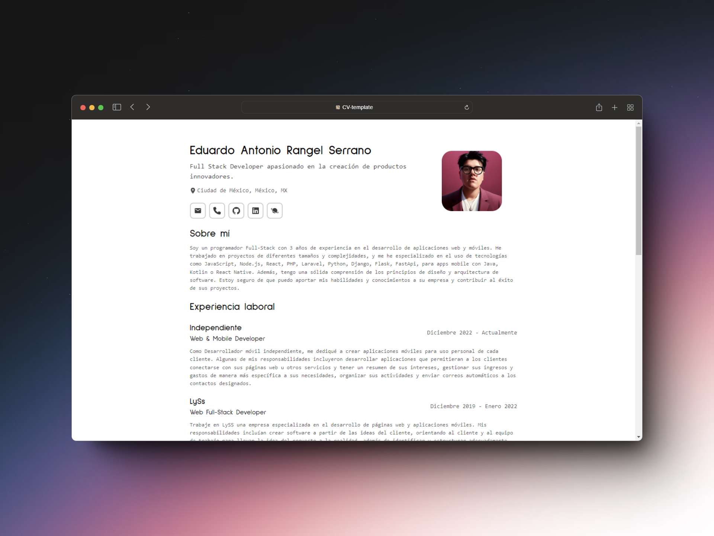

<h1 align="center" >Curriculum Minimalista</h1>

Curriculum minimalista inspirado en el proyecto <a href="https://github.com/BartoszJarocki/cv">BartoszJarocki</a> y <a href="https://github.com/midudev/minimalist-portfolio-json?tab=readme-ov-file">Midudev</a>

 
 
 
 
 

Este proyecto es una página web que funciona como un CV imprimible. Utiliza un archivo JSON para cargar la información de manera dinámica y está inspirado en los trabajos de [Bartosz Jarocki](https://github.com/BartoszJarocki) y [Miguel Ángel Durán](https://github.com/midudev), conocido como Midudev.

## Características

- **Imprimible**: Diseñado con un enfoque en la impresión para obtener un CV en papel con aspecto profesional.
- **Dinámico**: Toda la información se carga desde un archivo JSON, lo que facilita la actualización y mantenimiento del CV.
- **Inspiración**: Basado en las ideas y estilos de proyectos open-source de desarrolladores reconocidos.
- **Configurable** Configurable con un cambio de variables simples.

## Cómo usar

Para utilizar este proyecto, sigue estos pasos:

1. Clona el repositorio en tu máquina local.
2. Instala las dependencias con `npm install`.
3. Edita el archivo `CV-Español.json` o `CV-Ingles.json` con tu información personal.
4. Ejecuta el proyecto con `npm run dev`.
5. Abre tu navegador y navega a `http://localhost:5050`.
6. Imprime tu CV utilizando la función de impresión de tu navegador.

## Personalización

Puedes personalizar el estilo y la información de tu CV editando los siguientes archivos:

- `web.config.js`: Contiene variables de configuración para la web.
- `CV-Español.json`: Contiene toda la información personal que se mostrará en el CV en el idioma español.
- `CV-Ingles.json`: Contiene toda la información personal que se mostrará en el CV en el idioma ingles.
- `CV.js`: Importa el archivo JSON segun el idioma seleccionado en `web.config.js`.

## Contribuciones

Las contribuciones son bienvenidas. Si tienes alguna sugerencia o mejora, por favor, abre un issue o envía un pull request.

## Agradecimientos

Un agradecimiento especial a Bartosz Jarocki y Miguel Ángel Durán por su inspiración y contribuciones a la comunidad open-source.

---

  
  

